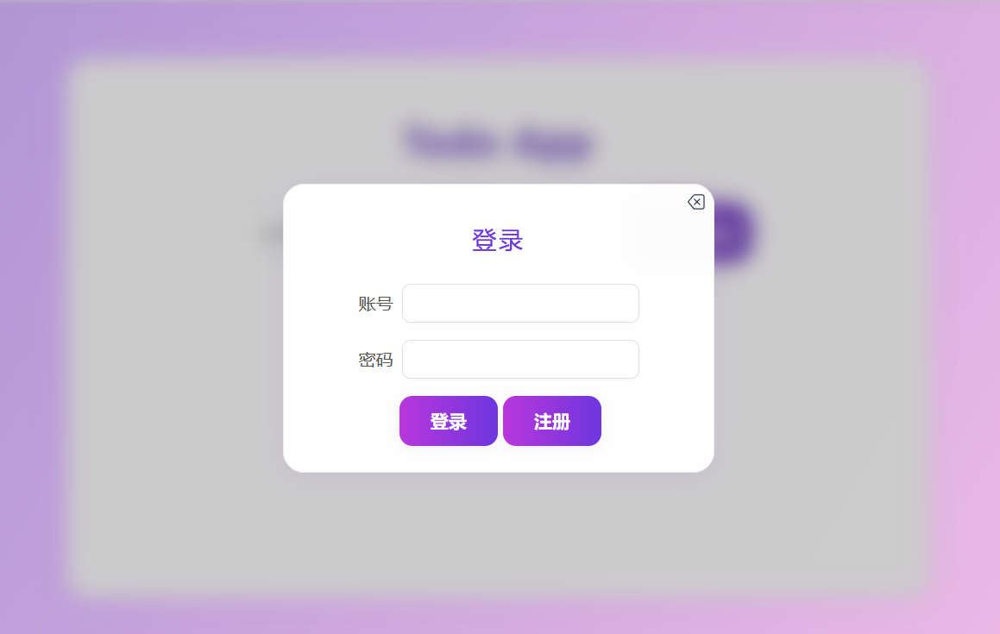
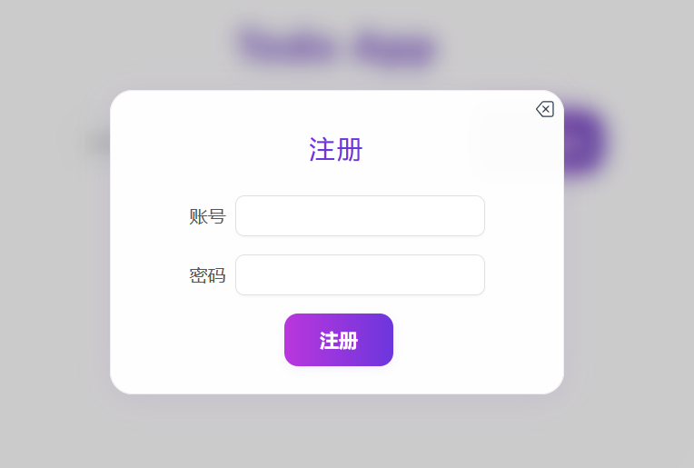
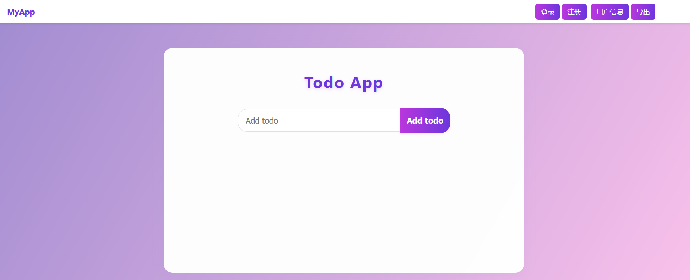

# 基于flask + vue的记事web前端

## Background


作为一个web全栈新手入门再适合不过
涉及简单的前端身份验证(jwt),增删改查,axios拦截器,vue框架简单使用等


## Usage

### 安装依赖

```bash
npm install
```

### 启动项目

```bash
npm run dev
```

## 效果预览








## 后端

### (todo-App)[https://github.com/yan-shengs/todo-App]
